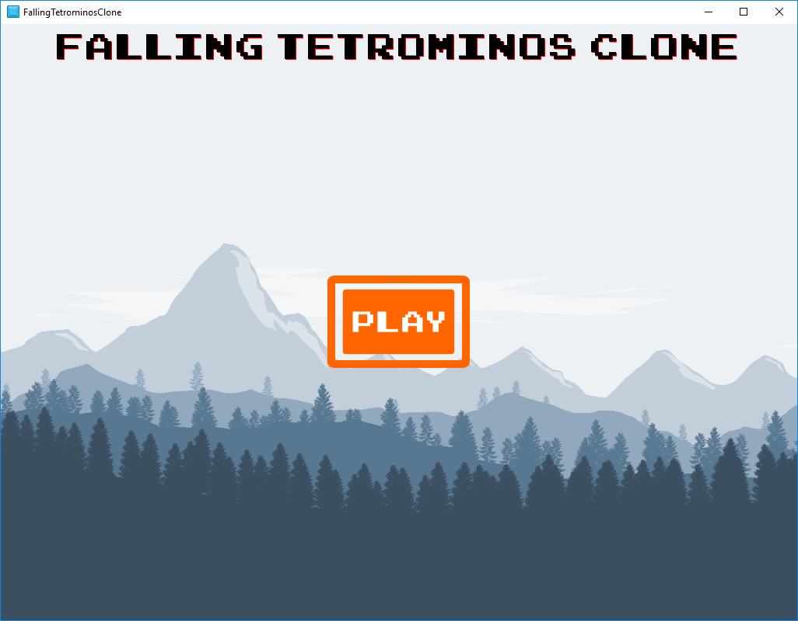
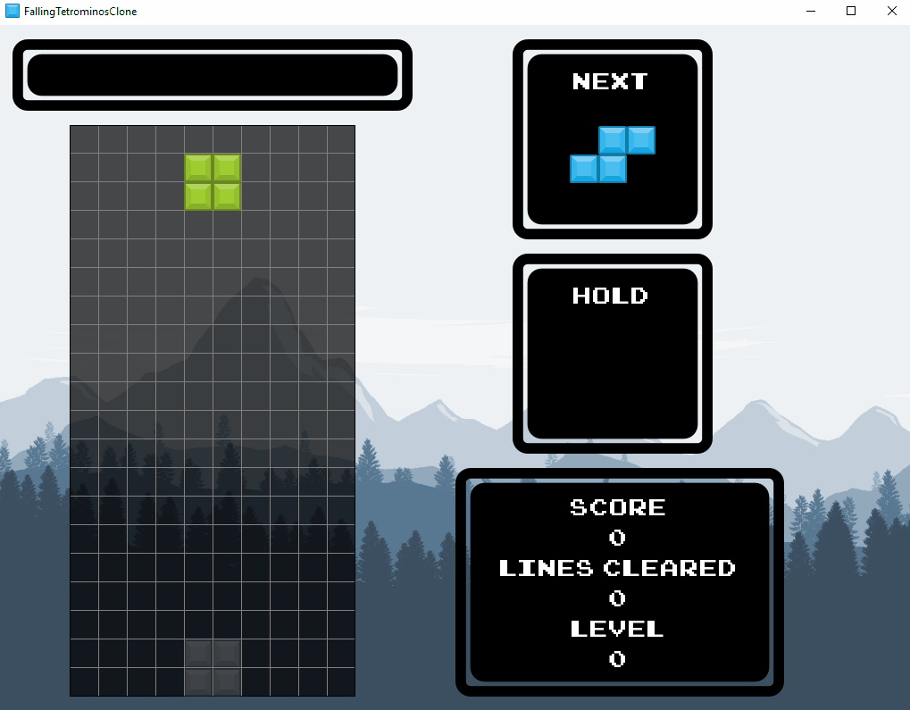
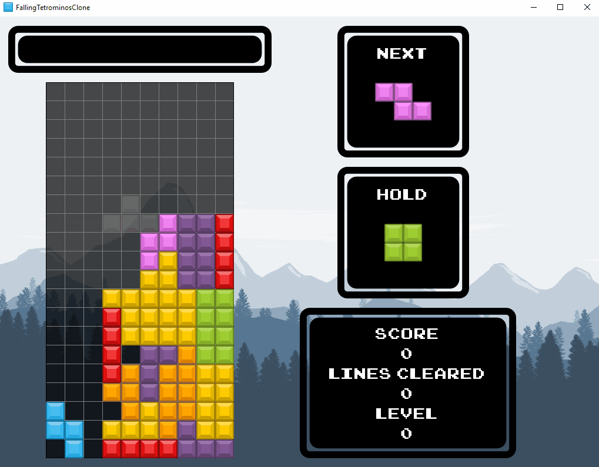
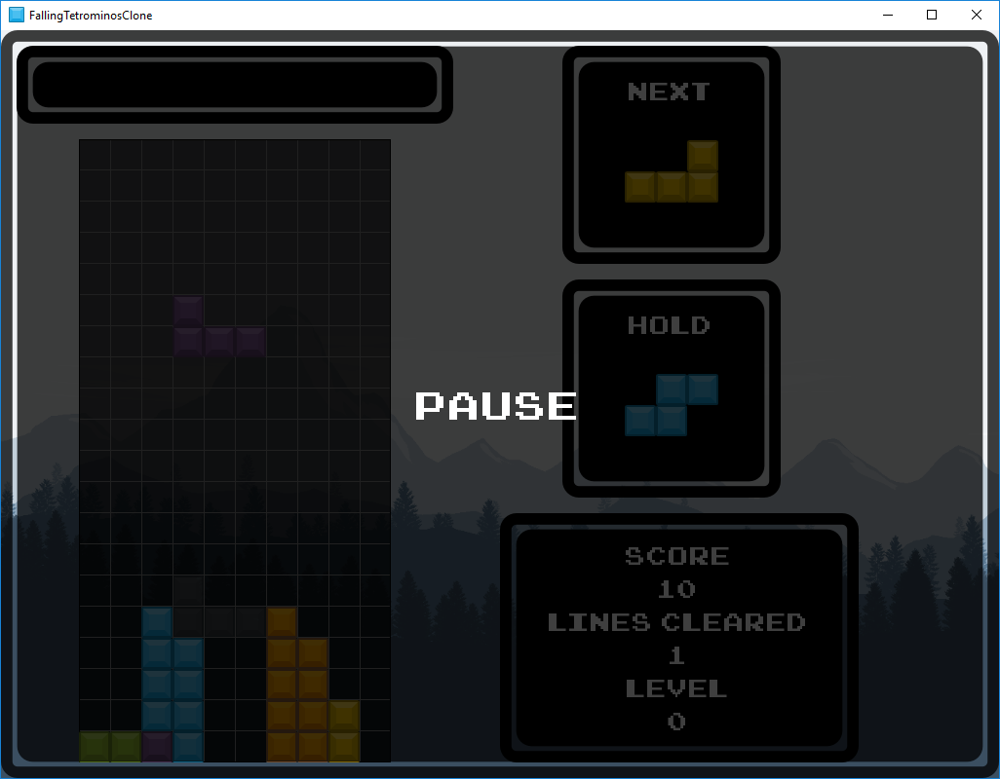
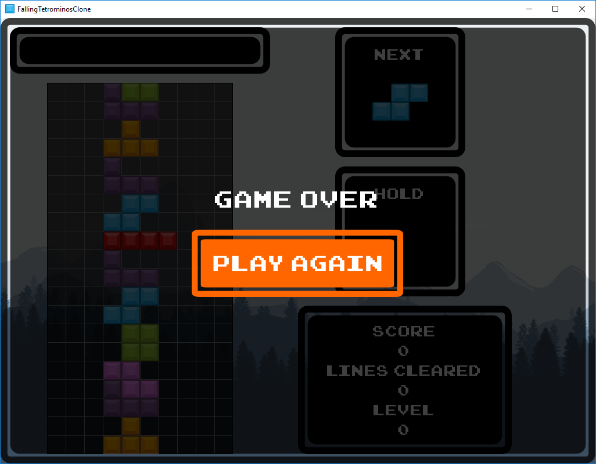

# FallingTetrominosClone

Into the deep end with game development!  In an effort to get properly started with game dev and to stop making excuses, I've decided to make clones of some common and fairly popular games and game genres.  For the 2D portion, I have decided to work with the Godot engine as it seems to be a very friendly environment, open source, free, and fun to use.  This is the third game I've made on the engine, and I thought it was about time to try out a puzzle game.  Although I'm awful at it, the puzzle game I've probably spent the most time playing is the one I've decided to clone.: the game about falling tetrominos.

## Game Clone Series
1. [Breakout](https://github.com/kazeraniman/BreakoutClone)
2. [Flappy Bird](https://github.com/kazeraniman/FlappyBirdClone)
3. [**Falling Tetrominos**](https://github.com/kazeraniman/FallingTetrominosClone)

## Learning Objectives

This is definitely the most complete game I've made as of yet.  In the initial attempt I wanted to stress the physics engine and try to do everything using it (rotation, clearing lines, etc.) but while it provided a good learning experience, it is simply not the way it should be done and unecessarily complicates things.  It also showed me that collision detection with convex shapes is funky.  This time around I started out by actually desigining the game then starting to code which turned out much better.  The core game didn't take long at all, but the intricacies took some extra thought and effort.  For example, I knew that rotation feels good in the original game, but I didn't know why [until I did some digging](http://tetris.wikia.com/wiki/SRS).  There's also some corner cases like wall-kicks resulting in possible infinites which had to be addressed which really gave me a better sense of how to think about breaking the game and fixing the game in fair ways.  This game was essentially just an exercise in deepening my understanding of everything I have previously discovered.  I used more of the export options for the actual release version of the game to properly add authoring and icons.  The UI this time around is a lot cleaner than any of the past ones and really does add to the experience.  I also learned how important some little design choices can be.  The main point here is that prior to adding a shadow to show where the piece will end up if hard-dropped, it was a bit difficult to guess as the grid lines kind of blend together at sufficient distance.  Just adding that shadow was enough to allow me to play a lot faster and got me thinking about other small tweaks which greatly increase playability and reduce player frustration.  The ability to pause was another item which I'd neglected to add in previous games but really is nice to have (both for debugging to allow placing breakpoints at certain states as well as for just natural play).  On the code side, rather than handling all the drawing through the engine, I took it by the reigns a bit and drew the cells myself in order to manage the puzzle state seperately which greatly simplifies rotation, clearing, and other factors.  This game being the most complex under-the-hood although at the surface it seems quite simple gave me a chance to dive deeper into player interaction and game design as a whole.

## Result

We start off with a title screen to not throw the player into the deep-end immediately.  Nothing too interesting to see here (although the background and music are quite pretty).

The general gameplay is exactly what you'd expect.  Tetrominos continually get generated and fall from the top to the bottom.  Through movements and rotations you try to place them such that you fill lines to clear them which opens up space on the grid.  In order to make hard-dropping easier to visually take in, a shadow of a piece moves along the bottom in step to show where the piece will land.  To help with planning, the next tetromino in the queue is displayed and the ability to hold a tetromino for later use is provided.  When a line is cleared, a cute jingle is played, the lines which were cleared flash, and the top of the screen displays the type of clear.  As more lines are cleared, the game speeds up to provide a continual challenge (although it does eventually cap out).  The score, lines cleared, and the level are kept track of in the bottom-right corner to continually challenge you to beat your best.

Certain clears are worth more than others.  A single-line clear is worth less than a double-line clear, which is worth less than a triple-line clear, which is worth less than a quadruple-line clear.  With all that being said, that isn't enough to really motivate you to get better or plan ahead.  All this really tells you is to save up quadruples all the time and do nothing else.  In order to provide a more engaging experience, performing the same clear in a row will increase the multiplier to boost the score further.  So continually doing single-line clears with no other type in between can actually surpass the score bonus of a quadruple-line clear!  That said, sequentially quadruple line clears do add up even faster, but take longer to set up.

Need even more of a challenge?  Well, you're better than me!  There's concept called T-Spinning which I believe is the way to achieve the highest-scoring clear in the game.  It involves using a T-shaped block and rotating it as the last move to clear lines.  Given the width of the tetromino is 3, this means a maximum of 3 lines can be cleared with a T-Spin, and you get rewarded heavily for it.  In fact, a double-line clear T-Spin is worth more than a quadruple-line clear done normally!  Adding in the consecutive, same clears, you can rack up points super quickly if you're good enough!

Should you need time to think (cheater) or just need to step away for a moment, pause functionality is provided.

Once the blocks hit the top of the screen, it's game over.  A little, sad jingle plays and you have the chance of starting again from 0.

## Controls

The controls follow two main schemes based on whether you would prefer to play with one hand or with two.  There is some repeated functionality for comfort and natural usage and some shared keys as it seems silly to duplicate for actions which are less common.

**Two-handed configuration**:
*Move Left*: Left arrow key  
*Move Right*: Right arrow key  
*Move Down*: Down arrow key  
*Rotate Right*: C or up arrow key  
*Rotate Left*: X  
*Hard-drop*: Spacebar  
*Hold piece*: Z  
*Pause*: P  
*Play / Play again*: Enter  

**One-handed configuration**:
*Move Left*: A  
*Move Right*: D  
*Move Down*: S  
*Rotate Right*: W or E  
*Rotate Left*: Q  
*Hard-drop*: Spacebar  
*Hold piece*: Shift  
*Pause*: P  
*Play / Play again*: Enter

## Resource Attribution

All resources which were not my creations are attributed in [attribution.md](attribution.md).
